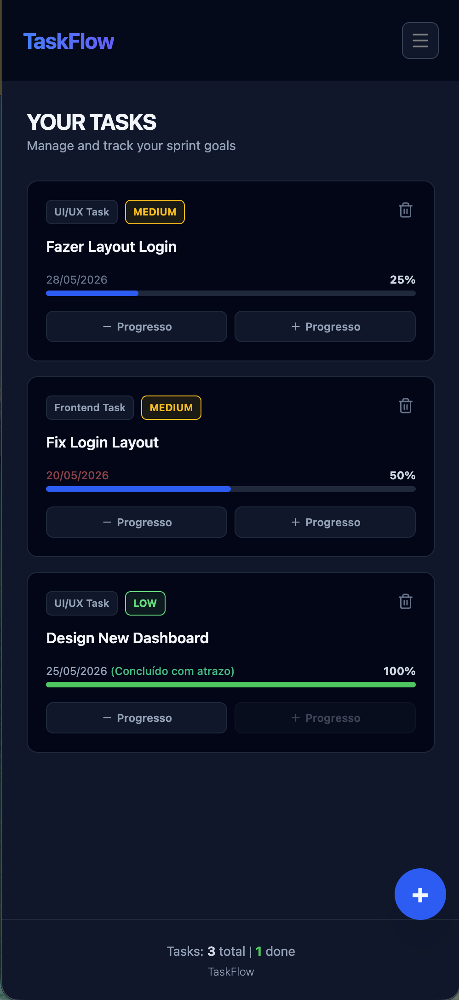
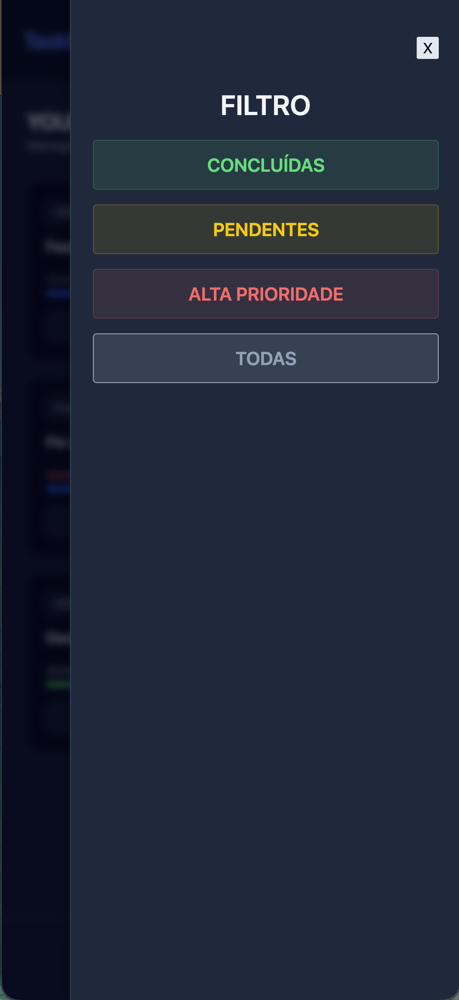
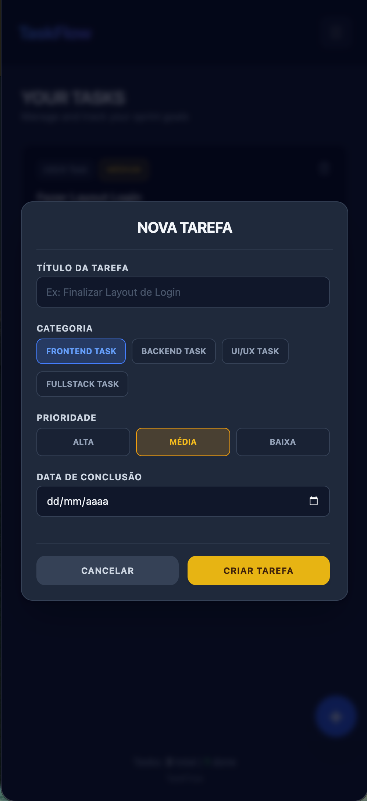

# 🚀 TaskFlow

A modern and intuitive daily task management application built with React, TypeScript, and Vite. The project was designed to improve organization and productivity, allowing users to create, filter, and track task progress efficiently.

---

## 🔗 Live Demo

The project is deployed and can be accessed online here:  
👉 [View TaskFlow Online](https://tasks-app-blue.vercel.app/)

---

## 📸 Project Preview

> 💡 **Note:**  
> Make sure to place your screenshot with the exact name `preview.jpg` (or `.png`) in the root folder of your project so it appears here and on GitHub!

<div align="center">





</div>

---

## 🛠️ Technologies Used

- ⚛️ **React** — Modern component-based UI with Hooks
- 🟦 **TypeScript** — Static typing for safer and more scalable code
- ⚡ **Vite** — Fast and optimized development environment
- 🎨 **Tailwind CSS / CSS Modules** — Modern and responsive styling
- ▲ **Vercel** — Deployment and hosting platform

---

## 📦 Features

- ✨ **Task Creation**  
  Add new tasks with titles and descriptions.

- 🔍 **Advanced Filters**  
  Filter tasks by status:
  - All
  - Pending
  - Completed

- 💾 **Data Persistence**  
  Tasks remain saved locally even after refreshing the page.

- 📱 **Responsive Design**  
  Fully adaptable interface for desktop, tablet, and mobile devices.

---

## 🚀 Running the Project Locally

If you want to download and run this project on your machine, follow the steps below:

### 1️⃣ Clone the repository

```bash
git clone https://github.com/rebecafloriano/tasks-app.git
```

### 2️⃣ Navigate to the project folder

```bash
cd tasks-app
```

### 3️⃣ Install dependencies

```bash
npm install
```

### 4️⃣ Start the development server

```bash
npm run dev
```

### 5️⃣ Open in your browser

Visit:

```bash
http://localhost:5173
```

---

## 📂 Project Structure

```bash
tasks-app/
├── src/
│   ├── components/
│   ├── pages/
│   ├── hooks/
│   ├── styles/
│   └── App.tsx
├── public/
├── preview.jpg
├── package.json
└── vite.config.ts
```

---

## 📄 License

This project is licensed under the **MIT License**.  
Feel free to use, modify, and share it.

---

## 💜 Author

Developed with 💜 by **Rebeca Erdman**

- GitHub: [@rebecafloriano](https://github.com/rebecafloriano)
